## Hi there 👋 I'm Renatus Madrigal

<!--
**AI1379/AI1379** is a ✨ _special_ ✨ repository because its `README.md` (this file) appears on your GitHub profile.

Here are some ideas to get you started:

- 🔭 I’m currently working on ...
- 🌱 I’m currently learning ...
- 👯 I’m looking to collaborate on ...
- 🤔 I’m looking for help with ...
- 💬 Ask me about ...
- 📫 How to reach me: ...
- 😄 Pronouns: ...
- ⚡ Fun fact: ...
-->

I'm currently a sophomore at [Zhejiang University](https://www.zju.edu.cn), majoring in Information and Computational Science. Glad to see you guys!

## 🌱 Currently Learning

## 🔭 Currently Working on

### Future Projects

There are some ideas that not have been implemented yet.

- [ ] PyTeXFlow - A simple LaTeX build system.

- [ ] HydrogenCMS - A WordPress-like CMS in C++ using ASIO

## 🔥 Mostly Used Languages

## ⚡ Fun fact

I'm a big fan of *Genshin Impact* and *Honkai: Star Rail*, as well as Disney's *Frozen*. I'm glad to make friends with anyone who shares common interests!

## 📫 How to reach me

Personal Email: [listener1381@outlook.com](mailto:listener1381@outlook.com)

Education Email: [arendellian13@zju.edu.cn](mailto:arendellian13@zju.edu.cn)
